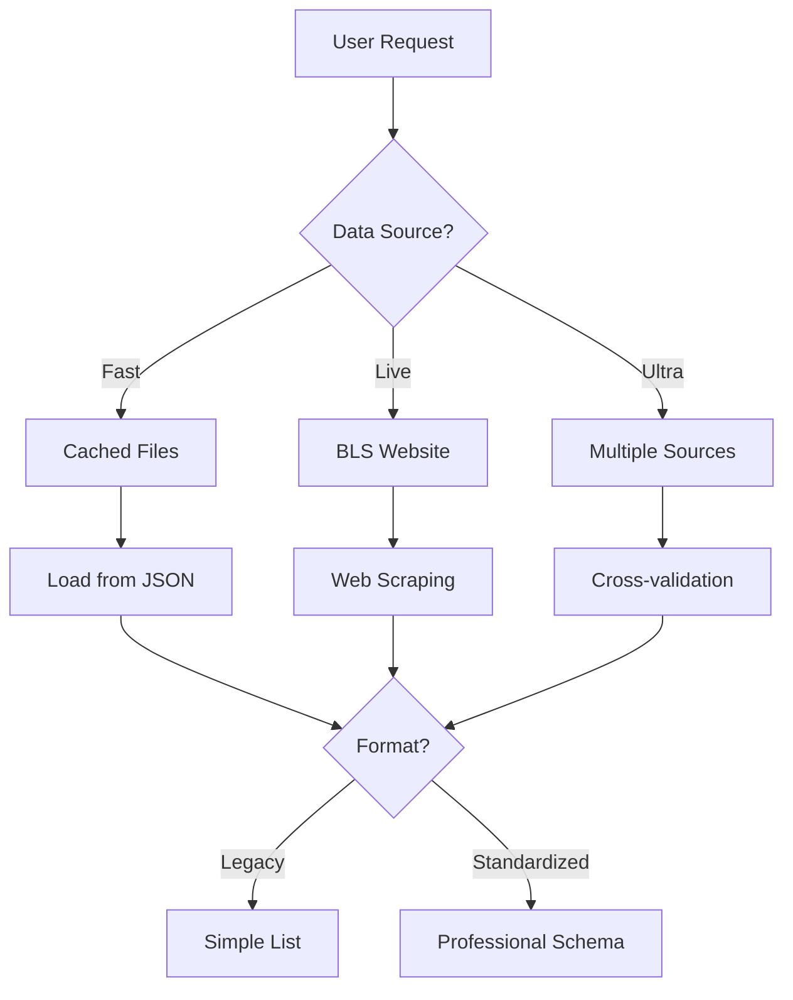

# BLS Scraper API - Developer Guide

## 🎯 Overview

The BLS Scraper API is a production-ready Python library for accessing US Bureau of Labor Statistics economic data. It provides both **fast cached data** (millisecond response) and **live web scraping** (always fresh data) with professional standardized outputs suitable for hedge funds and trading systems.

## 🏗️ Architecture

### Core Components

```
BLS Scraper API/
├── app/                          # Core API modules
│   ├── fast_bls_api.py          # Fast cached data API
│   ├── live_bls_scraper.py      # Live web scraping API
│   ├── standardized_schema.py   # Professional data schema
│   └── ultra_fresh_scraper.py   # Multi-source verification
├── cached_data/                 # Pre-cached BLS data
├── docs/                        # Documentation
└── scripts/                     # Utility scripts
```

### Data Flow



## 🚀 Quick Setup

### Prerequisites
- Python 3.8+
- Git
- Internet connection

### Installation Steps

1. **Clone Repository**
   ```bash
   git clone https://github.com/yourusername/bls-scraper-api.git
   cd "BLS Scraper API"
   ```

2. **Install Dependencies**
   ```bash
   pip install -r requirements.txt
   ```

3. **Verify Installation**
   ```bash
   python -c "from app.fast_bls_api import load_data; print('✅ Success!')"
   ```

4. **Run Demo**
   ```bash
   python simple_bls_dashboard.py
   ```

## 📊 API Usage Patterns

### Pattern 1: Simple Data Access
```python
from app.fast_bls_api import load_data

# Get recent inflation data
cpi_data = load_data('cpi', '2024')
latest_cpi = cpi_data[0]['value']
```

### Pattern 2: Professional Format
```python
from app.fast_bls_api import load_data

# Get institutional-grade response
response = load_data('cpi', '2024', standardized=True)
print(f"Data quality: {response['metadata']['quality']}")
print(f"Source: {response['metadata']['source']}")
```

### Pattern 3: Live Fresh Data
```python
from app.live_bls_scraper import load_data

# Always fresh data (takes 1-3 seconds)
fresh_data = load_data('cpi', '2024')
print(f"Scraped at: {fresh_data[0]['scraped_at']}")
```

### Pattern 4: Multi-Indicator Analysis
```python
from app.fast_bls_api import FastBLSAPI

api = FastBLSAPI()
data = api.load_multiple(['cpi', 'ppi', 'unemployment'], '2024')
```

## 🔧 Integration Strategies

### Strategy 1: Import as Module
```python
# Add to your project
import sys
sys.path.append('/path/to/BLS Scraper API')

from app.fast_bls_api import load_data
```

### Strategy 2: Copy Core Files
```bash
# Copy just the essential files
cp app/fast_bls_api.py your_project/
cp app/standardized_schema.py your_project/
cp -r cached_data/ your_project/
```

### Strategy 3: Package Installation
```python
# Install as editable package
pip install -e "/path/to/BLS Scraper API"
```

## 📈 Performance Optimization

### Choose the Right API

| Use Case | Best API | Typical Speed | Trade-offs |
|----------|----------|---------------|------------|
| High-frequency trading | Fast Cached | 0.5-2ms | Historical data only |
| Real-time monitoring | Live Scraper | 50-300ms | Always fresh |
| Critical decisions | Ultra Fresh | 200-500ms | Multi-source verified |
| Backtesting | Fast Cached | 0.5-2ms | Fastest possible |

### Performance Tips

1. **Use Parallel Loading**
   ```python
   api = FastBLSAPI(max_workers=20)
   data = api.load_multiple(['cpi', 'ppi'], '2024')
   ```

2. **Cache Management**
   ```python
   # Custom cache location
   api = FastBLSAPI(cache_dir="my_custom_cache")
   ```

3. **Minimize Data Range**
   ```python
   # Load only what you need
   data = load_data('cpi', '2024')  # Not '2000-2024'
   ```

## 🛡️ Error Handling Best Practices

### Robust Data Loading
```python
def safe_load_data(ticker, date_range, retries=3):
    """Load data with automatic fallback and retries"""
    
    for attempt in range(retries):
        try:
            # Try fast cached first
            data = load_cached(ticker, date_range, standardized=True)
            
            if data and data.get('success'):
                return data
            
            # Fallback to live scraping
            print(f"Cached failed, trying live scraper (attempt {attempt + 1})")
            data = load_live(ticker, date_range, standardized=True)
            
            if data and data.get('success'):
                return data
                
        except Exception as e:
            print(f"Attempt {attempt + 1} failed: {e}")
            if attempt == retries - 1:
                raise
    
    return None
```

### Graceful Degradation
```python
def get_inflation_data():
    """Get inflation data with graceful degradation"""
    
    # Try different data sources in order of preference
    sources = [
        ('cpi', 'Consumer Price Index'),
        ('cpi_core', 'Core CPI'),
        ('ppi', 'Producer Price Index')
    ]
    
    for ticker, name in sources:
        try:
            data = load_data(ticker, '2024')
            if data:
                print(f"Using {name} data")
                return data
        except:
            continue
    
    raise Exception("No inflation data available")
```

## 🔍 Data Quality Validation

### Validation Functions
```python
def validate_economic_data(data):
    """Validate economic data quality"""
    
    if not data:
        return False, "No data provided"
    
    # Check for standardized format
    if isinstance(data, dict):
        if not data.get('success'):
            return False, f"API error: {data.get('error', {}).get('message')}"
        
        quality = data.get('metadata', {}).get('quality', 'unknown')
        if quality == 'low':
            return False, "Data quality too low"
        
        data_points = data.get('data', [])
    else:
        data_points = data
    
    # Check data completeness
    if len(data_points) < 3:
        return False, "Insufficient data points"
    
    # Check for recent data
    latest_date = data_points[0].get('date', '')
    if '2024' not in latest_date:
        return False, "Data not recent enough"
    
    return True, "Data validation passed"

# Usage
data = load_data('cpi', '2024', standardized=True)
is_valid, message = validate_economic_data(data)
if not is_valid:
    print(f"Data validation failed: {message}")
```

## 📊 Analytics Integration

### With Pandas
```python
import pandas as pd
from app.fast_bls_api import load_data

def create_economic_dataframe():
    """Create a comprehensive economic DataFrame"""
    
    indicators = ['cpi', 'cpi_core', 'ppi', 'unemployment']
    dataframes = []
    
    for indicator in indicators:
        data = load_data(indicator, '2020-2024')
        if data:
            df = pd.DataFrame(data)
            df['date'] = pd.to_datetime(df['date'])
            df = df.set_index('date')[['value']]
            df.columns = [indicator.upper()]
            dataframes.append(df)
    
    return pd.concat(dataframes, axis=1).sort_index()
```

### With NumPy
```python
import numpy as np

def calculate_volatility(ticker, window=30):
    """Calculate rolling volatility"""
    
    data = load_data(ticker, '2023-2024')
    values = np.array([point['value'] for point in data])
    
    # Calculate returns
    returns = np.diff(np.log(values))
    
    # Rolling volatility
    volatility = np.std(returns) * np.sqrt(252)  # Annualized
    return volatility
```

## 🔄 Real-Time Systems

### Continuous Monitoring
```python
import time
import threading
from datetime import datetime

class EconomicDataMonitor:
    """Real-time economic data monitoring system"""
    
    def __init__(self, update_interval=300):  # 5 minutes
        self.update_interval = update_interval
        self.latest_data = {}
        self.running = False
    
    def start_monitoring(self):
        """Start continuous monitoring"""
        self.running = True
        thread = threading.Thread(target=self._monitor_loop)
        thread.daemon = True
        thread.start()
    
    def _monitor_loop(self):
        """Main monitoring loop"""
        while self.running:
            try:
                # Get fresh data
                fresh_data = load_live('cpi', '2024')
                
                if fresh_data:
                    current_value = fresh_data[0]['value']
                    timestamp = datetime.now().isoformat()
                    
                    # Check for significant changes
                    if 'cpi' in self.latest_data:
                        prev_value = self.latest_data['cpi']['value']
                        change = abs(current_value - prev_value) / prev_value
                        
                        if change > 0.001:  # 0.1% change
                            print(f"🚨 CPI Alert: {current_value} (change: {change:.2%})")
                    
                    self.latest_data['cpi'] = {
                        'value': current_value,
                        'timestamp': timestamp
                    }
                
                time.sleep(self.update_interval)
                
            except Exception as e:
                print(f"Monitoring error: {e}")
                time.sleep(60)  # Wait before retrying

# Usage
monitor = EconomicDataMonitor(update_interval=180)  # 3 minutes
monitor.start_monitoring()
```

## 🚀 Production Deployment

### Environment Configuration
```python
import os
from app.fast_bls_api import FastBLSAPI

# Production configuration
api = FastBLSAPI(
    cache_dir=os.getenv('BLS_CACHE_DIR', 'cached_data'),
    max_workers=int(os.getenv('BLS_MAX_WORKERS', '20'))
)
```

### Health Checks
```python
def health_check():
    """API health check for production"""
    
    try:
        # Test cached API
        start_time = time.time()
        data = load_cached('cpi', '2024')
        cache_latency = (time.time() - start_time) * 1000
        
        # Test live API
        start_time = time.time()
        live_data = load_live('cpi', '2024')
        live_latency = (time.time() - start_time) * 1000
        
        return {
            'status': 'healthy',
            'cached_api': {
                'available': bool(data),
                'latency_ms': cache_latency,
                'data_points': len(data) if data else 0
            },
            'live_api': {
                'available': bool(live_data),
                'latency_ms': live_latency,
                'data_points': len(live_data) if live_data else 0
            },
            'timestamp': datetime.now().isoformat()
        }
        
    except Exception as e:
        return {
            'status': 'unhealthy',
            'error': str(e),
            'timestamp': datetime.now().isoformat()
        }
```

## 📚 Additional Resources

### Documentation Files
- **[QUICK_START_GUIDE.md](QUICK_START_GUIDE.md)** - 5-minute setup guide
- **[API_REFERENCE.md](API_REFERENCE.md)** - Complete function reference
- **[STANDARDIZED_DATA_SCHEMA.md](STANDARDIZED_DATA_SCHEMA.md)** - Professional format docs

### Example Scripts
- **[example_integrations.py](example_integrations.py)** - Integration examples
- **[simple_bls_dashboard.py](simple_bls_dashboard.py)** - Working dashboard
- **[scripts/](scripts/)** - Utility scripts

### Performance Testing
```bash
# Run performance comparison
python simple_bls_dashboard.py

# Test specific functionality
python example_integrations.py
```

## 🤝 Contributing

### Development Setup
```bash
# Clone and setup development environment
git clone https://github.com/yourusername/bls-scraper-api.git
cd "BLS Scraper API"
pip install -r requirements.txt

# Run tests
python -m pytest tests/  # If you add tests

# Check code quality
python -c "from app.fast_bls_api import load_data; print('✅ All good!')"
```

### Adding New Data Sources
1. Update `series_map` in relevant API files
2. Add data URLs in scraper configurations  
3. Update documentation with new tickers
4. Test with various date ranges

---

This developer guide provides everything needed to integrate, deploy, and maintain the BLS Scraper API in production environments. For specific use cases, refer to the example files and API reference documentation. 